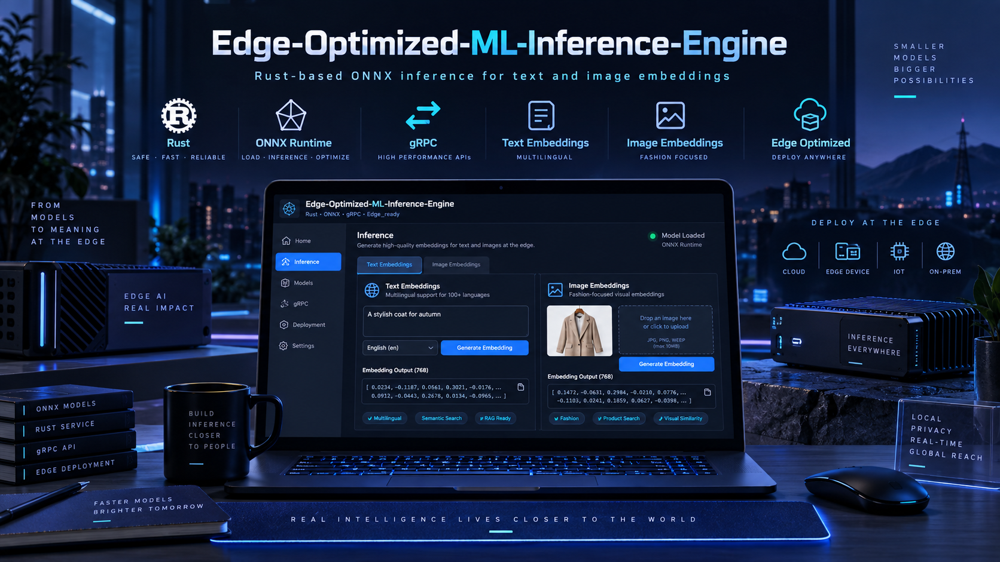
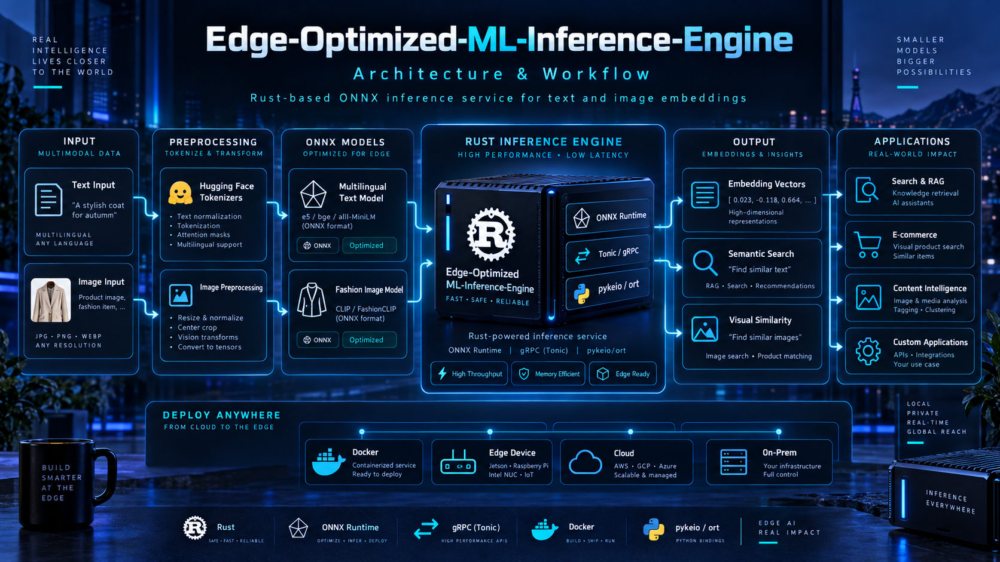
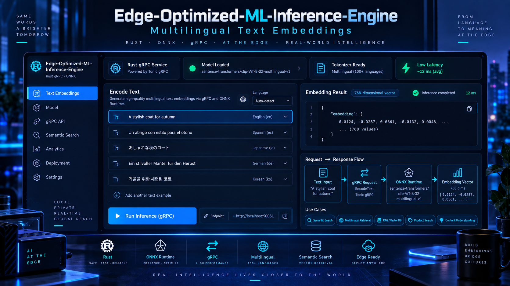
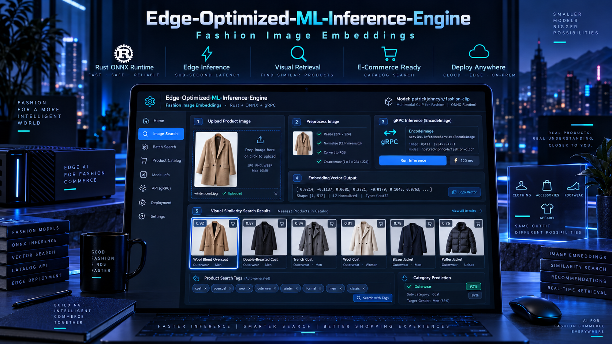
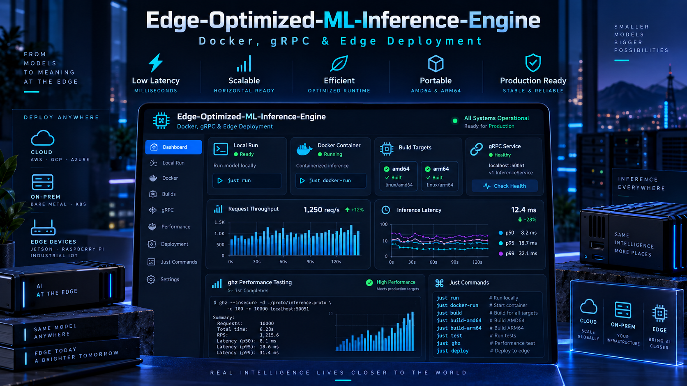
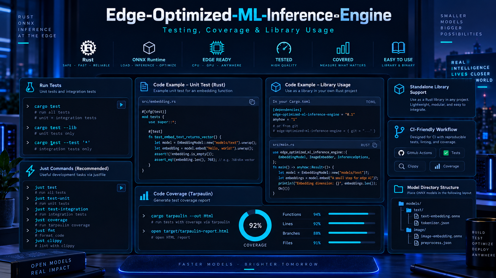

# Edge-Optimized-ML-Inference-Engine

<p align="center">
  
  
  
  
  
  
</p>

<p align="center">
  
</p>

> A Rust-based ONNX inference engine for fast, efficient, and deployment-friendly **text and image embeddings** with **gRPC APIs**, **Docker support**, and **edge-ready performance**.

---

## Overview

**Edge-Optimized-ML-Inference-Engine** is a production-oriented Rust service built for efficient ML inference at the edge. It loads ONNX models, exposes high-performance gRPC endpoints, and generates embeddings for both **multilingual text** and **fashion-focused images**.

The project is designed for scenarios where you want:
- **fast inference** with Rust and ONNX Runtime,
- **clean service APIs** with gRPC/Tonic,
- **containerized deployment** with Docker,
- **easy benchmarking and testing**, and
- **reusable library support** inside other Rust projects.

It is especially well-suited for **semantic search**, **visual similarity search**, **retrieval systems**, **catalog intelligence**, and **edge AI workloads**.

---

## Contents

- [Overview](#overview)
- [Key Highlights](#key-highlights)
- [Project Preview](#project-preview)
- [Features](#features)
- [Architecture & Workflow](#architecture--workflow)
- [Getting Started](#getting-started)
- [Installation](#installation)
- [Model Export](#model-export)
- [Build & Run](#build--run)
- [Testing](#testing)
- [Docker](#docker)
- [Usage as a Library](#usage-as-a-library)
- [gRPC Service](#grpc-service)
- [Recommended Use Cases](#recommended-use-cases)
- [Contributing](#contributing)
- [License](#license)
- [Contact](#contact)

---

## Key Highlights

- **Written entirely in Rust** for performance, safety, and reliability.
- **ONNX Runtime integration** via `pykeio/ort` for efficient model loading and execution.
- **gRPC service built with Tonic** for fast binary APIs.
- **Multilingual text embeddings** using ONNX-exported `sentence-transformers/clip-ViT-B-32-multilingual-v1`.
- **Fashion-focused image embeddings** using ONNX-exported `patrickjohncyh/fashion-clip`.
- **Docker-ready deployment** for local, cloud, or edge environments.
- **Performance benchmarking** with `ghz`.
- **Coverage reporting** with Tarpaulin.
- **Can be used as a standalone Rust library** in other projects.

---

## Project Preview

### 1) Hero Overview
<p align="center">
  
</p>

### 2) Architecture & Workflow
<p align="center">
  
</p>

### 3) Multilingual Text Embeddings
<p align="center">
  
</p>

### 4) Fashion Image Embeddings
<p align="center">
  
</p>

### 5) Deployment & Performance
<p align="center">
  
</p>

### 6) Testing, Coverage & Library Usage
<p align="center">
  
</p>

---

## Features

### Core ML Inference
- **Text embeddings** through ONNX-exported multilingual CLIP text models.
- **Image embeddings** through ONNX-exported Fashion-CLIP image models.
- **Low-latency inference** optimized for edge environments.
- **Reusable embeddings** for search, retrieval, and ranking applications.

### Service Layer
- **gRPC API with Tonic** for efficient service communication.
- **Simple request/response interface** for text and image encoding.
- **Easy integration** with backend services and microservice architectures.

### Developer Experience
- **Justfile commands** for common workflows.
- **Unit and integration tests** built with native Rust tooling.
- **Coverage reporting** with Tarpaulin.
- **Performance testing** with `ghz`.
- **Docker support** for containerized builds and deployment.

### Deployment
- **Local execution** for development.
- **Docker containers** for reproducible environments.
- **Cloud, on-prem, and edge deployment** flexibility.
- **Suitable for AMD64 and ARM64 workflows**.

---

## Architecture & Workflow

<p align="center">
  
</p>

### High-Level Flow

```text
Input (Text / Image)
        ↓
Preprocessing
  - HF tokenizers for text
  - Image transforms for images
        ↓
ONNX Models
  - Multilingual text model
  - Fashion image model
        ↓
Rust Inference Engine
  - ONNX Runtime
  - gRPC (Tonic)
  - pykeio/ort
        ↓
Embeddings / Similarity / Search Outputs
        ↓
Applications
  - RAG / semantic retrieval
  - visual product search
  - recommendation / similarity
  - custom AI services
```

### Main Components
- **Rust service layer** for orchestration and API handling.
- **ONNX Runtime** for inference execution.
- **Text preprocessing** with Hugging Face tokenizers.
- **Image preprocessing** for vision model inputs.
- **gRPC service endpoints** for external consumers.

---

## Getting Started

### Prerequisites

Make sure you have the following installed:

- Recent version of **Rust**
- **Docker**
- **Just** – https://github.com/casey/just
- **ghz** for gRPC performance testing – https://ghz.sh/
- **cargo-tarpaulin** for coverage – https://crates.io/crates/cargo-tarpaulin
- **Python 3.11+** for exporting ONNX models with Hugging Face Optimum
- **act** *(optional)* for testing GitHub Actions locally – https://github.com/nektos/act

---

## Installation

1. Install Rust and Cargo:
   ```bash
   https://www.rust-lang.org/tools/install
   ```

2. Install **Just**.

3. Install **Tarpaulin** *(optional, for coverage reports)*.

4. Install **act** *(optional, for local GitHub Actions testing)*.

5. Install **ghz** *(optional, for performance testing)*.

6. Clone the repository:
   ```bash
   git clone https://github.com/AsadAliEng/Edge-Optimized-ML-Inference-Engine.git
   ```

7. Move into the project directory:
   ```bash
   cd Edge-Optimized-ML-Inference-Engine
   ```

8. Build the project:
   ```bash
   just build
   ```

---

## Model Export

To use the text and image embedding models, export them to ONNX format using Hugging Face Optimum.

### 1) Install Optimum CLI from source

```bash
python -m pip install "optimum[onnxruntime] @ git+https://github.com/huggingface/optimum.git" transformers sentence-transformers
```

### 2) Export the multilingual text model

```bash
optimum-cli export onnx -m sentence-transformers/clip-ViT-B-32-multilingual-v1 --task feature-extraction models/text
```

### 3) Export the fashion image model

```bash
optimum-cli export onnx -m patrickjohncyh/fashion-clip --task feature-extraction models/image
```

### Notes
- Accurate export of **`clip-ViT-B-32-multilingual-v1`** depends on the latest Optimum version.
- In the current setup:
  - **`clip-ViT-B-32-multilingual-v1`** is used for **text embeddings**.
  - **`fashion-clip`** is used for **image embeddings**.

---

## Build & Run

### Build
```bash
just build
```

### Build Docker Image
```bash
just build-docker
```

### Run Locally
```bash
just run
```

### Run Docker Container
```bash
just run-docker
```

---

## Testing

<p align="center">
  
</p>

### Unit Testing
```bash
just unit-test
```

### Integration Testing
```bash
just integration-test
```

### Coverage Reporting
```bash
just coverage
```

### Performance Testing for Text
```bash
just perf-test-for-text
```

### Useful Native Rust Commands
```bash
cargo test
cargo test --lib
cargo tarpaulin --out Html
```

---

## Docker

<p align="center">
  
</p>

You can run the service in Docker once your models are ready:

```bash
docker run -v ./models:/models -v ./config.toml:/config.toml edge-optimized-ml-inference-engine:latest
```

### Why Docker?
- reproducible environments,
- simpler deployment,
- cleaner local setup,
- better CI/CD integration.

---

## Usage as a Library

The project can also be used as a library inside other Rust applications.

> **Important:** your ONNX models must already exist under `models/text` and `models/image`.

### Add the crate

```bash
cargo add edge-optimized-ml-inference-engine
```

### Expected text-model directory structure

```text
models/text/
├── config.json
├── model.onnx
├── special_tokens_map.json
├── tokenizer_config.json
├── tokenizer.json
└── vocab.txt
```

### Example Rust usage

```rust
use edge_optimized_ml_inference_engine::{config::Config, embed::EmbedText};

fn main() {
    let embed_text = EmbedText::new(
        &"models/text/model.onnx",
        &"sentence-transformers/clip-ViT-B-32-multilingual-v1",
    )
    .expect("failed to initialize text model");

    let query_embedding = embed_text.encode(&"this is a sentence".to_string());

    println!("Embedding generated with {} values", query_embedding.len());
}
```

---

## gRPC Service

The gRPC service provides two main methods.

### `EncodeText`
Encodes a text input into an embedding vector.

#### Request
```protobuf
message TextRequest {
  string text = 1;
}
```

#### Response
```protobuf
message EncoderResponse {
  repeated float embedding = 3;
}
```

### `EncodeImage`
Encodes an image input into an embedding vector.

#### Request
```protobuf
message ImageRequest {
  bytes image = 2;
}
```

#### Response
```protobuf
message EncoderResponse {
  repeated float embedding = 3;
}
```

### Suggested Endpoint Concept
```text
localhost:50051
```

---

## Recommended Use Cases

### Text Embeddings
- semantic search
- multilingual retrieval
- RAG pipelines
- content understanding

### Image Embeddings
- fashion similarity search
- product discovery
- catalog intelligence
- visual recommendation systems

### Platform Use Cases
- edge retail AI
- low-latency inference services
- embedded search systems
- high-performance Rust microservices

---

## Contributing

1. Fork the repository.
2. Create a new branch:
   ```bash
   git checkout -b feature-name
   ```
3. Make your changes and commit them:
   ```bash
   git commit -am 'Add some feature'
   ```
4. Push to the branch:
   ```bash
   git push origin feature-name
   ```
5. Open a pull request.

---

## License

This project is licensed under the **MIT License**. See the `LICENSE.md` file for details.

---

## Contact

For questions or feedback:

- GitHub: [@AsadAliEng](https://github.com/AsadAliEng)
- Email: [asadali.cryptoeng@gmail.com](mailto:asadali.cryptoeng@gmail.com)

---

## Author

This README package was structured for the repository **Edge-Optimized-ML-Inference-Engine**, based on a Rust + ONNX + gRPC inference workflow for text and image embeddings.
 
---
 
## 👨‍💻 Developer
 
<table>
  <tr>
    <td width="150" align="center">
      <br>
      <strong>Asad Ali</strong>
    </td>
    <td>
      <strong>AI, Blockchain & Software Engineer</strong><br><br>
      🐙 GitHub: <a href="https://github.com/AsadAliEng">@AsadAliEng</a><br>
      📧 Email: <a href="mailto:asadali.cryptoeng@gmail.com">asadali.cryptoeng@gmail.com</a><br>
      🚀 Focus: intelligent systems, applied machine learning, AI security, Web3 products, automation, and production-oriented engineering
    </td>
  </tr>
</table>


